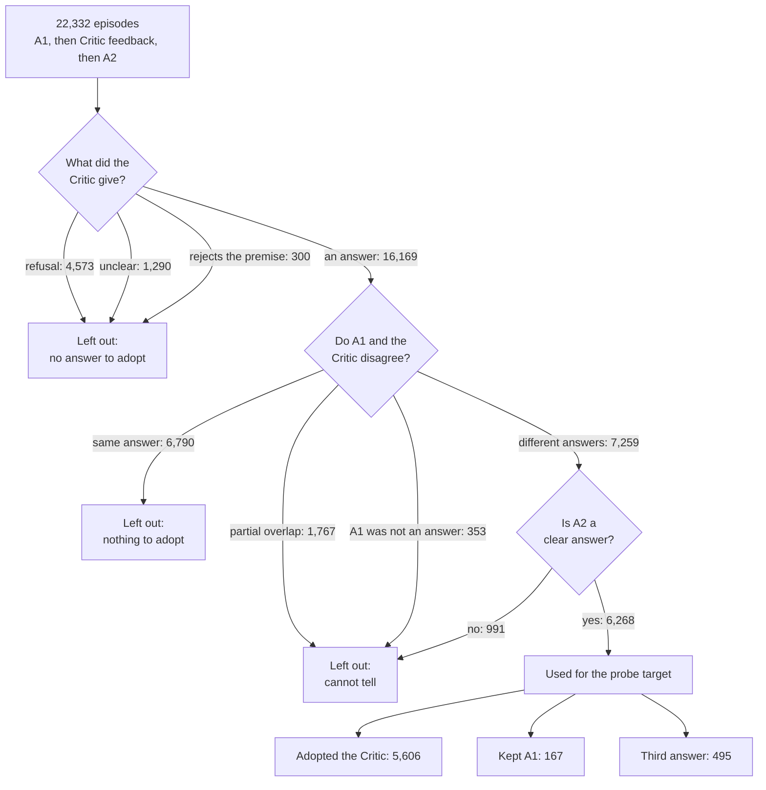

# Behavior v0.1: labelling how the Solver responds to Critic feedback

Status: candidate labels, not yet checked by human annotators. Rule version `behavior_v0.1.1_candidate`.

## The problem this solves

Each episode in our production run has three parts: the Solver answers a question (A1), the Critic reviews that answer, and the Solver answers again (A2). The project asks whether the Solver's internal activations predict if it will take the Critic's answer.

Our first label, `lexical_v2`, compared A2 with the Critic's answer and called a match "adopted". Reading the data showed that this mixes different situations. In about one episode in five the Critic does not give an answer at all: it refuses ("the passage does not specify") or rejects the question's premise. When the Solver then repeats that refusal, `lexical_v2` could count it as adoption. A probe trained on that label would partly be learning "the Critic refused", which is not the behavior we want to study.

## Two labels instead of one

Behavior v0.1 answers two separate questions for every episode.

| Label | Question it answers | Values |
|---|---|---|
| `feedback_type` | What did the Critic give? | `answer`, `refusal`, `premise_rejection`, `unresolved` |
| `solver_response` | What did the Solver do in A2? | `adopted_critic`, `retained_a1`, `third_answer`, `unchanged_same_position`, `non_answer`, `produced_answer`, `unresolved` |

The rules are in `src/mas_sae/evaluation/behavior_v01.py`. They compare normalized text, so "Paris" and "Paris, France" are treated as a partial match and left out rather than guessed.

There are three label layers, and each one is kept:

| Layer | Status |
|---|---|
| `lexical_v2` | The original labels from the collection run. Unchanged. |
| `behavior_v0.1.1_candidate` | The labels proposed here. Automatic, not yet validated. |
| `human_validated_behavior_v1` | Empty for every row until human annotation is finished. |

## What the 22,332 episodes look like



The same numbers as a table:

| Situation | Episodes | Share |
|---|---:|---:|
| A1 and the Critic already agree (nothing to adopt) | 6,790 | 30.4% |
| **A1 and the Critic give different answers, and A2 is clear (a candidate conflict)** | **6,268** | **28.1%** |
| Critic refused to answer | 4,573 | 20.5% |
| A1 and Critic answers partially overlap | 1,767 | 7.9% |
| Critic was non-committal or unclear | 1,290 | 5.8% |
| A2 only partially matches either answer | 838 | 3.8% |
| A1 was itself a refusal or a hedge | 353 | 1.6% |
| Critic rejected the question's premise | 300 | 1.3% |
| A2 was a refusal | 153 | 0.7% |

Only the row in bold is used for the probe target. We call these candidate conflicts, not proven disagreements, because the rules compare text and two differently worded answers can mean the same thing. The other rows are kept and labelled, and the reason each one is excluded is recorded.

## The prediction target

Within the 6,268 candidate conflicts:

| Solver's second answer | Episodes | Share |
|---|---:|---:|
| Adopted the Critic's answer | 5,606 | 89.4% |
| Kept its own answer | 167 | 2.7% |
| Gave a third answer | 495 | 7.9% |

- **Primary target:** adopted (1) versus not adopted (0, kept or third answer). The two kinds of non-adoption are always reported separately.
- **Strict target:** adopted versus kept only. With 167 kept cases in the whole dataset this can be described, but any held-out number will have wide error bars. Resampling does not create new examples.

Because adoption is so common, a model that always predicts "adopted" is 89% accurate. Accuracy is therefore not a useful measure here; we report balanced accuracy, precision and recall per class, and the confusion matrix.

## What the labels already show

Using the correctness flags recorded during collection:

| | Adopted | Kept A1 | Third answer |
|---|---:|---:|---:|
| Critic's answer was correct (1,836) | 1,824 (99.3%) | 5 | 7 |
| Critic wrong, A1 wrong (3,766) | 3,247 (86.2%) | 85 (2.3%) | 434 |
| Critic wrong, A1 correct (666) | 535 (80.3%) | 77 (11.6%) | 54 |

Two things follow. First, the Solver defers heavily: it gives up a correct answer for a wrong one four times out of five. Second, almost all non-adoption happens when the Critic is wrong, so a probe could succeed simply by detecting a weak Critic answer. Any probe result needs a text-only baseline and a breakdown by Critic correctness before it is interpreted.

## Keeping evaluation honest

Each question belongs to one partition, taken from the full production run:

| Partition | Questions | Used for | Adopted / kept / third |
|---|---:|---|---|
| discovery | 13,396 | fitting, choosing layers and features, tuning | 3,413 / 102 / 293 |
| validation | 4,469 | testing a configuration that is already frozen | 1,089 / 30 / 116 |
| intervention | 4,467 | the later causal experiments | 1,104 / 35 / 86 |

We found one problem and fixed it. The layer scan re-ran 2,500 of the same questions but assigned their splits independently, so 1,370 of them have a different split in the scan, and 576 that the scan calls "discovery" are held out in the full run. Choosing a layer on the scan and then testing on the full run would have leaked. The rule now is that the full run's split is the only one used; `split_manifest.csv` records it for every question.

973 held-out questions (476 validation, 497 intervention) were part of earlier development data: they are in the layer scan or in the first 100-row QC sample. We know these questions were available during development. We did not record whether each one was actually looked at or used in a decision. They are flagged `in_development_data`, and held-out results should be reported with and without them.

`load_production_activations` in `src/mas_sae/data/production.py` asks the caller to state a purpose (`fit`, `tune`, `evaluate`, `intervene`) and refuses rows from the wrong partition. It also checks each row's activation index and the activation file's size against the manifest, so layer-scan rows cannot be read against full-run files (or the reverse) and return another question's activations. For layer-scan data pass `run="scan"`.

## Human check

The labels are string rules, so they need to be checked by people. A blind packet of 542 discovery episodes is ready: every "kept" case in discovery (102) plus 40 from each other situation, shuffled together. Annotators see the question, the source paragraphs, A1, the Critic's feedback and A2, and none of our labels. A second annotator independently labels 120 of the rows. `scripts/qc_agreement.py` then reports agreement and lists the disagreements. Instructions are in `docs/qc_guide.md`.

Until that is done, `human_validated_behavior_v1` is empty for every row and results built on these labels are exploratory.

## Where the code is

| File | What it does |
|---|---|
| `src/mas_sae/evaluation/behavior_v01.py` | The labelling rules, and reading and writing `labels.csv` |
| `src/mas_sae/evaluation/behavior_qc.py` | Builds the blind QC packet and scores annotator agreement |
| `src/mas_sae/data/production.py` | The split table and the loader that enforces it |
| `scripts/prepare_behavior_v01.py` | Runs the steps above on the finished production run |
| `scripts/qc_agreement.py` | Compares two completed annotator files |

The scripts only read arguments and call the package functions. Existing project helpers are reused for JSONL reading, file hashing, safe output folders and the pinned MuSiQue loader.

## Rebuilding and using the labels

```bash
PYTHONPATH=src python scripts/prepare_behavior_v01.py \
    --artifacts /home/ubuntu/capstone-artifacts \
    --output /home/ubuntu/capstone-artifacts/<new folder> \
    --reuse-qc /home/ubuntu/capstone-artifacts/behavior_v01_20261001/qc
```

This writes `labels.csv`, `split_manifest.csv`, `counts.json` and the `qc/` packet. `counts.json` also records the Git commit and the hashes of the rule files that produced the labels. The collection run folders are read and never changed. Activation tensors stay outside Git.

```python
from mas_sae.data.production import load_labeled_rows, load_production_activations

rows, manifest = load_labeled_rows("<artifacts>/natural_4b_full/results", "<package folder>")
train = [r for r in rows if r["canonical_split"] == "discovery" and r["label"]["eligible_primary"]]
y = [r["label"]["primary_target"] for r in train]
X = load_production_activations(train, manifest, "<artifacts>/natural_4b_full/data",
                                purpose="fit", layer=17, attempt=2)   # attempt=1 is before feedback
```

## Limits

- Labels are provisional until the human check is complete.
- String matching cannot recognise aliases. "USA" and "United States" count as two different answers, so some episodes labelled as disagreements are really agreements, and some "third answers" are really adoptions. Only partial overlaps such as "Paris" / "Paris, France" are excluded. The human check measures how often this happens.
- The premise-rejection rule includes the bare word "premise"; 29 of its 300 matches depend on that word alone and should be read by hand.
- Correctness flags come from the collection run's own answer matching and can be wrong.
- A probe that predicts these labels shows prediction, not a causal mechanism.

## Next steps

1. Two annotators complete the blind packet; measure agreement; adjust rules if needed and freeze Behavior v1.
2. Probe and SAE work (Raye, Josh) uses discovery questions only, with a text baseline and a breakdown by Critic correctness. An early look on discovery data suggested A2 activations predict adoption better than the feedback text does (balanced accuracy about 0.84 versus 0.75); that is unvalidated and is theirs to reproduce properly.
3. Held-out validation is run once, on a frozen configuration.
